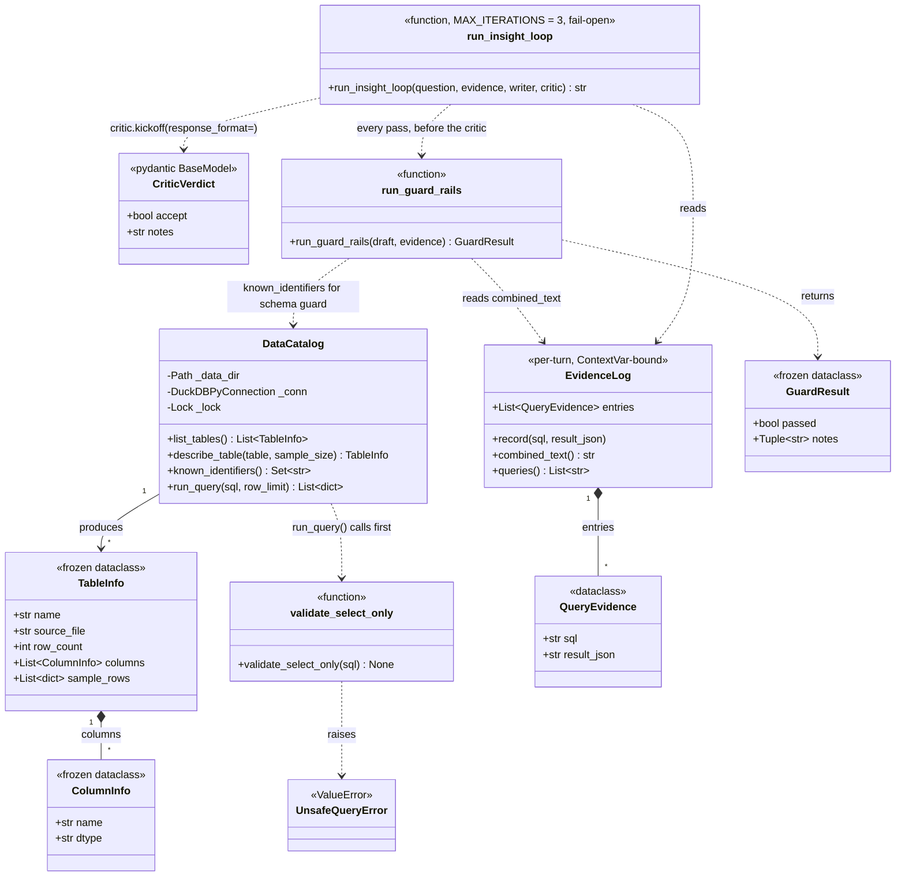
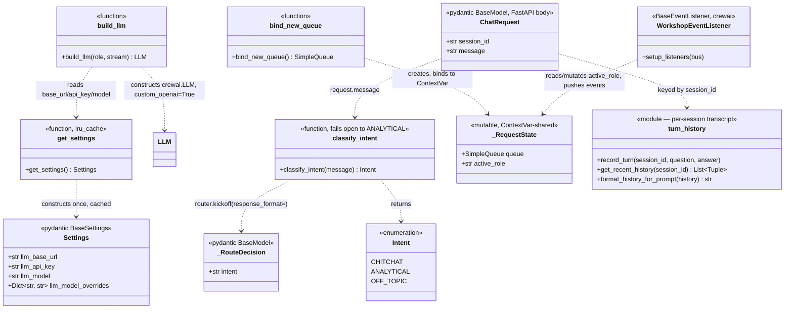
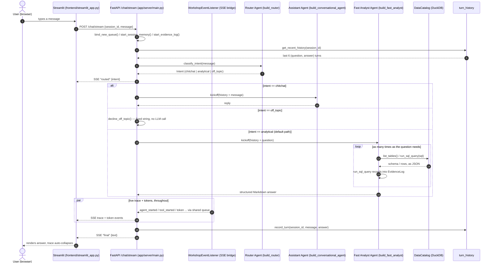
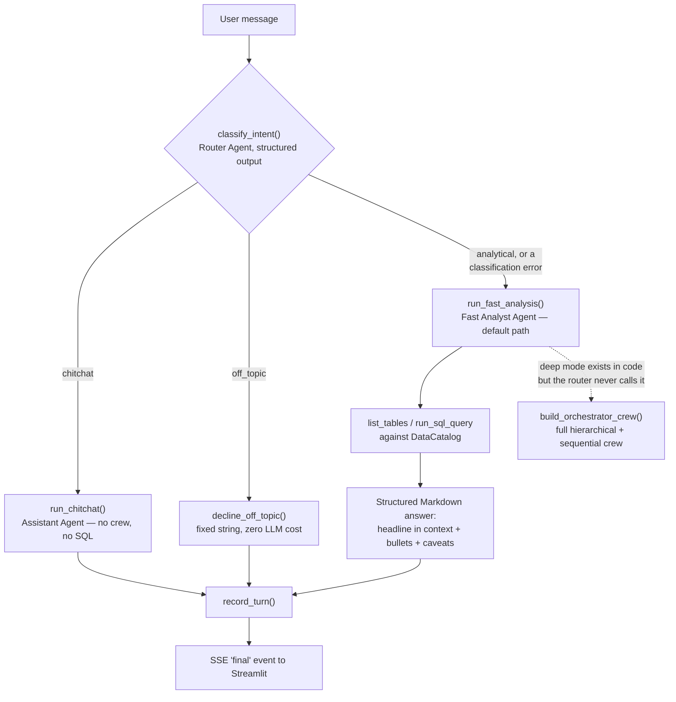
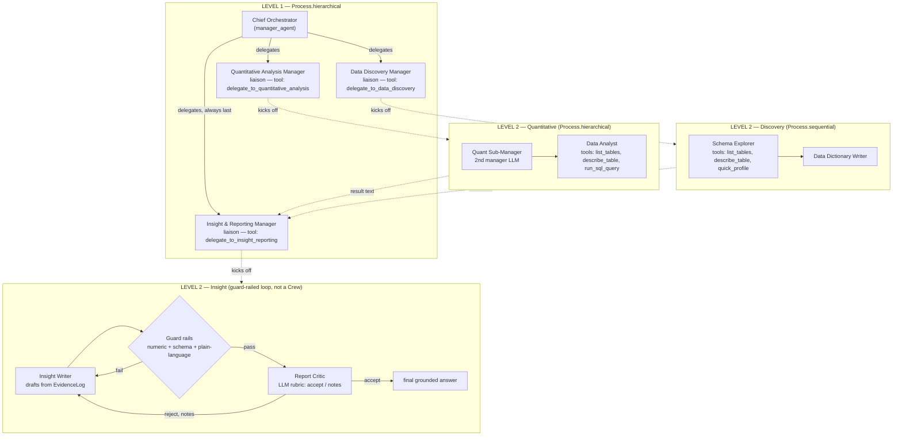

# Multi-Level CrewAI Analytics Chatbot

Developed by **Syed Junaid Iqbal** — connect on [LinkedIn](https://www.linkedin.com/in/syedjunaidiqbal/).

A workshop reference project: a chatbot that answers analytical questions
over a dynamic set of CSVs, built with [CrewAI](https://docs.crewai.com),
FastAPI, and Streamlit — demonstrating hierarchical **and** sequential
orchestration, multiple manager LLMs at different levels of the hierarchy,
memory, planning, reasoning, function-calling tools ("skills"), and a
grounded writer/critic guard-rail loop, all streamed live to the browser
over Server-Sent Events (SSE).

## Architecture

```
Streamlit chat  ──HTTP POST + SSE──▶  FastAPI  ──▶  Orchestrator Crew (LEVEL 1)
(frontend/streamlit_app.py)          (app/server/main.py)   Process.hierarchical
                                                              manager_agent = Chief Orchestrator
                                                                     │
                       ┌─────────────────────────────┼─────────────────────────────┐
                       ▼                              ▼                             ▼
        Quantitative Analysis (LEVEL 2)   Data Discovery (LEVEL 2)    Insight & Reporting (LEVEL 2)
        Process.hierarchical              Process.sequential          guard-railed writer/critic loop
        manager_agent = 2nd manager LLM   Schema Explorer ──▶         (app/critique/analyst_critic.py):
        + Data Analyst (SQL tools)        Data Dictionary Writer      draft → deterministic guards →
                                                                       LLM critic → revise, capped
```

Every LLM call — every manager, every specialist, planning, memory
analysis, the critic — goes through the **OpenAI Python SDK only**
(`crewai`'s native `OpenAICompletion` provider, forced with
`custom_openai=True`; see `app/llm/factory.py`). litellm is never invoked.

The dataset in [`data/`](data/) is **dynamic**: every table/column name is
discovered at call time from whatever CSVs are present (`app/data/catalog.py`,
DuckDB-backed) — drop in a new CSV and it's queryable immediately, no code
change or restart required to be *discovered* (a running server re-globs
`data/*.csv` on every tool call).

## Setup

Requires [`uv`](https://docs.astral.sh/uv/) and the three variables already
in `.env` (`LLM_BASE_URL`, `LLM_API_KEY`, `LLM_MODEL` — an OpenAI-compatible
chat completions endpoint).

One more variable is *optional*: `LLM_MODEL_OVERRIDES` lets specific agent
roles use a different model than `LLM_MODEL`, against that same endpoint/key
— e.g. a lighter model for the liaison agents, a stronger one for the Data
Analyst. It's a JSON object, `role -> model`; see the commented-out example
and the full list of role keys in `.env`. Leave it unset and every agent
uses `LLM_MODEL`.

```bash
uv sync
```

## Run

Two processes, in two terminals:

```bash
uv run uvicorn app.server.main:app --reload                          # backend, http://localhost:8000
uv run streamlit run frontend/streamlit_app.py --server.port 80      # frontend, http://localhost
```

...or both at once, for convenience:

```bash
sudo uv run main.py
```

The UI listens on port 80 (plain `http://localhost`, no port needed) —
that's a privileged port, so it needs `sudo` (or a `sudo`-run terminal on
Windows/WSL). Change `UI_PORT` at the top of `main.py`, or drop
`--server.port 80` from the manual command above, to run on Streamlit's
default `:8501` without elevated privileges instead.

Then ask something like *"Which city has the most orders?"* or *"What data
do we have about returns?"* and watch the live trace: the Chief Orchestrator
delegates, sub-crews run their own queries, and the Insight & Reporting
manager drafts, self-checks, and streams the final grounded answer.

## Project layout

```
app/
  config.py                 Settings — reads only the 3 required .env vars
  llm/factory.py             build_llm(): every LLM instance, OpenAI SDK only
  data/catalog.py            DuckDB catalog, dynamically built from data/*.csv
  tools/                     "skills": list_tables, describe_table, quick_profile, run_sql_query
  memory/embedder.py         local, no-API-key embedder for crew memory (chromadb's bundled ONNX model)
  agents/agent_factory.py    every Agent used anywhere in the project
  crews/                     assembles the multi-level hierarchical + sequential crews
  critique/                  the grounded writer → guard rails → critic → revise loop
  events/stream_bus.py       bridges CrewAI's event bus to a per-request SSE queue
  session/conversation_store.py   per chat-session isolated crew memory
  server/main.py             FastAPI app — POST /chat/stream (SSE), GET /health
frontend/
  streamlit_app.py           the chat UI
main.py                      convenience launcher for both processes
```

## Diagrams

Everything below is generated straight from the classes and functions that
actually exist in this codebase (not an idealized sketch) — every name here
is grep-able. GitHub renders these Mermaid diagrams inline.

### Class diagram — data, evidence & guard rails



### Class diagram — settings, routing & streaming



### Sequence diagram — one chat turn (fast path, default)



### Flow diagram — request routing



### Flow diagram — deep mode: the full multi-level crew

Not on the default path (see above), but still fully wired and runnable
directly — this is the hierarchical + sequential, multi-manager-LLM
architecture the workshop set out to demonstrate.



The Insight loop is capped at `MAX_ITERATIONS = 3` and fails open: if it
never converges, the last draft ships anyway rather than blocking the user
(see `app/critique/analyst_critic.py`).

### Tools ("skills") reference

| Tool | Defined in | Used by | What it does |
| --- | --- | --- | --- |
| `list_tables` | `app/tools/schema_tools.py` | Fast Analyst, Data Analyst, Schema Explorer | Every table's columns + types + row counts, re-discovered from `data/*.csv` on every call |
| `describe_table` | `app/tools/schema_tools.py` | same | Schema + a few sample rows for one table |
| `quick_profile` | `app/tools/schema_tools.py` | Schema Explorer | Numeric/categorical summary stats for one column |
| `run_sql_query` | `app/tools/sql_tool.py` | Fast Analyst, Data Analyst | Validated, read-only SQL (`SELECT`/`WITH` only — see `validate_select_only`) against the DuckDB catalog; every call is recorded into that turn's `EvidenceLog` |

### SSE events reference

Every event `WorkshopEventListener` (or `app/server/main.py` itself) puts
on the queue, in the shape the frontend actually parses (`event: <type>`,
`data: <json>`):

| Event | Emitted when | Key fields |
| --- | --- | --- |
| `routed` | intent classification finishes | `intent` |
| `crew_started` / `crew_completed` / `crew_failed` | a `Crew.kickoff()` begins/ends — deep mode only | `crew_name` [, `error`] |
| `agent_started` / `agent_completed` / `agent_error` | an `Agent` or `LiteAgent` begins/ends | `role` [, `error`] |
| `agent_reasoning_started` / `agent_reasoning_completed` | a `reasoning=True` agent plans | `role` [, `plan`] |
| `task_started` / `task_completed` | a `Task` begins/ends — deep mode only | `description` |
| `tool_started` / `tool_finished` / `tool_error` | a tool call begins/ends | `tool`, `role` [, `args`/`error`] |
| `token` | one streamed LLM chunk | `role`, `text` |
| `final` | the turn's answer is ready | `text` |
| `error` | the turn raised an exception | `text` |

---

Developed by **Syed Junaid Iqbal** — let's connect on [LinkedIn](https://www.linkedin.com/in/syedjunaidiqbal/).

# data-analyst-agent
